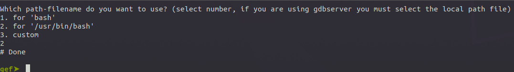
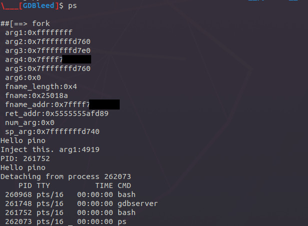

# start guide #


 - [video](./)


 1. Delete old gdbleed session which is saved into folder `/tmp/gdbleed`

```
rm -rf /tmp/gdbleed
```


 2. Attach gdb to gdbserver session

```
# e.g. we have /bin/bash with pid 258475, then we launch gdbserver as follows
gdbserver --attach 127.0.0.1:12345 258475

# on gdb session
cd <gdbleed-folder>
gdb /bin/bash -ex "source ~/.gdbinit-gef.py" -ex "target remote 127.0.0.1:12345" -ex "source gdbleed.py"

```


 3. Because gdbleed does not know if the debuggee program is running in local or in remote it will ask you to choose on which path the binary is present. In any case if we are using gdbserver the 2nd options should be choosed. This information is later saved in gdbleed session (folder `/tmp/gdbleed`)





 4. Inspect got entries 
```
gef➤  got-entries
...
[0x563275d6ced8] ---> socket
[0x563275d6cee0] ---> mktemp

gef➤  got-entries fork
[0x563275d6ce90] ---> fork
```


 5. Create static variables

```
gef➤  hook-got-inline --help
Help
Usage: hook-got-inline [options] <function_name>

   Options:
       --help              : This message
       --create            : insert gdbleed script from STDIN or by file <file_path>
       --data              : Define or list global/static vars
       --list              : print declared functions nformation
       --source-code       : print function's source code
       --remove            : delete function <function_name>
       --compile           : Compile function
       --inject            : inject mode
       --inject-ret        : inject-ret mode
       --inject-post       : inject-post mode
       --inject-post-ret   : inject-post-ret mode
       --inject-full       : inject-full mode

 Notes:
   --inject                : call pre_func, jump to function-hooked
   --inject-ret            : jump directly to pre_func and return its return value
   --inject-post           : call function-hooked, post_func, then return function-hooked's return values
   --inject-post-ret       : call function-hooked, post_func and return ist return value
   --inject-full           : call pre_func, function-hooked, post_func, then return function-hooked's return value

```

```
gef➤  hook-got-inline --data --create
Insert gdbleed script (Insert 'EOF' line to terminate reading input)
int x = 10;
char * pino = "Hello pino\n";
blob data1 = 128;
EOF

gef➤  hook-got-inline --data --list
Id              declaration
0               int x = 10;
1               char * pino = 0x25001f; // size=0xd
2               void * data1 = 0x25002b; // size=0x80

```

 6. Create internal functions

```
gef➤  hook-got-inline --create ./example/bleed_example/internal_func.c.bleed
/tmp/gdbleed/inspect_status.print_pino.c: In function ‘print_pino’:

[...]

Code compiled or maybe not, you should check that and change stuff (folder '/tmp/gdbleed/inspect_status.print_pino.c.o').
Do you want to retry compilation? (y/Y/-)


/tmp/gdbleed/inspect_status.call_print_pino.c: In function ‘call_print_pino’:

[...]

Code compiled or maybe not, you should check that and change stuff (folder '/tmp/gdbleed/inspect_status.call_print_pino.c.o').
Do you want to retry compilation? (y/Y/-)

gef➤  hook-got-inline --list
Id     namespace         full_name                         addr
0x0    inspect_status    inspect_status.call_print_pino    0x20018e
0x1    inspect_status    inspect_status.print_pino         0x2000ed

```

 - print inspect_status.call_print_pino's details

```
gef➤  hook-got-inline --list inspect_status.call_print_pino
Id     namespace         full_name                         addr
0x0    inspect_status    inspect_status.call_print_pino    0x20018e
 \---> description:
Inspect arguments given to the hooking functions 'pre_func' and 'post_func'

 \---> declaration:
int call_print_pino(int j){

 \---> used_by_function:
[]

 \---> hooking_function:
{'inspect_status.print_pino'}
```

```
gef➤  hook-got-inline --source-code inspect_status.call_print_pino
'inspect_status.call_print_pino' source code:

// here we insert includes and struct typedf etc.
//  - we can have only one "define" sub-section
#include <sys/types.h>
#include <unistd.h>


int call_print_pino(int j){
void * (*getpid)() = 0x7ffff7e640f0;
void * (*printf)(void *, ...) = 0x7ffff7de1cc0;
int * (*print_pino) (int i) = 0x2000ed;
char * p = 0x2500ab; // size=0x17
char * p2 = 0x2500c1; // size=0xa
char * pino = 0x25001f; // size=0xd
// ## code starts from here:

  return print_pino(j);
}

```


 7. Create pre_func which does call static variables and internal functions declared before

```
gef➤  hook-got-inline --create ./example/bleed_example/inspect_status[x86_64].c.bleed
gef➤  hook-got-inline --list
Id     namespace         full_name                         addr
0x0    inspect_status    inspect_status.call_print_pino    0x20018e
0x1    inspect_status    inspect_status.print_pino         0x2000ed
0x2    inspect_status    inspect_status.pre_func           None


gef➤  hook-got-inline --source-code inspect_status.pre_func
'inspect_status.pre_func' source code:
void * pre_func(void * __arg1__, void * __arg2__, void * __arg3__, void * __arg4__, void * __arg5__, void * __arg6__, unsigned long __fname_length__, char * __fname__, void * __fname_addr__, void * __ret_addr__, unsigned long __num_arg__, void * __sp_arg__){
void * (*printf)(void *, ...) = 0x7ffff7de1cc0;
int * (*call_print_pino) (int j) = 0x20018e;
char * p = 0x2500ca; // size=0xc1
char * pino = 0x25001f; // size=0xd
  int i = 0x1337;
// ## code starts from here:
  printf(p, __fname__, __arg1__, __arg2__, __arg3__, __arg4__, __arg5__, __arg6__, __fname_length__, __fname__, __fname_addr__, __ret_addr__, __num_arg__, __sp_arg__);
  printf(pino);
  call_print_pino(i);
  return 1111;
return 0;
}

```


 8. Compile it and then hook 'fork' calls

```
gef➤  hook-got-inline --compile inspect_status.pre_func
/tmp/gdbleed/inspect_status.pre_func.c: In function ‘pre_func’:

[...]

Code compiled or maybe not, you should check that and change stuff (folder '/tmp/gdbleed/inspect_status.pre_func.c.o').
Do you want to retry compilation? (y/Y/-)

gef➤  hook-got-inline --inject inspect_status.pre_func fork
[TraceHook] Can't find symbol on '.dynstr', is imported by ordinale number.. searching it on LIBC memory space
[TraceHook] Can't find symbol 'fork' on libc, inserting it by hand at addr '0x25018a'

gef➤  continue
```


Result:




 9. Trace each external call passing from plt.got section

```
gef➤  hook-got-inline --inject --trace-all inspect_status.pre_func

```


